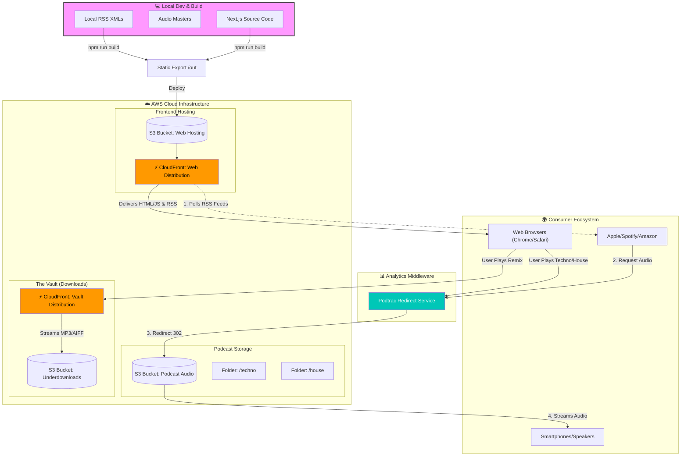

# DIPLOMATIC ENJOY

** Electronic Music & Audio Research**

> A high-performance, static-generated audio platform serving the *Diplomatic Enjoy* podcast network and DJ archives. Built with Next.js App Router, AWS CloudFront, and a headless RSS-driven CMS.

---

## 📸 Interface

| **The Feed (Bento Grid)** | **The Vault (Archives)** |
|:---:|:---:|
|  |  |
| *Dynamic bento-grid layout for podcast episodes* | *Utilitarian file directory for lossless AIFFs* |

---

## 🏗 Architecture

This project moves away from traditional CMS databases, instead treating **RSS Feeds as the Source of Truth**. The site is statically generated (`SSG`) at build time, ensuring 0ms server latency and 100% cache-hit ratios on CloudFront.

## ⚡ Key Features

### 1. The Global "Deck" (Persistent Player)
A custom audio player built with **Zustand** global state. It persists across route navigation, allowing users to browse "Techno" or read "Funk" history without interrupting the mix.
- Supports background audio.
- Handles multiple formats (Streamable MP3 vs Downloadable AIFF).

### 2. RSS-as-CMS
There is no database. The site parses local XML files (`public/rss/*.xml`) at build time using `fast-xml-parser`.
- **Techno Feed:** Aggregates industrial/warehouse mixes.
- **House & Funk Feed:** Aggregates deep house and rare groove.
- **SEO Injection:** HTML tracklists from the RSS description are sanitized and injected into the DOM for maximum search visibility.

### 3. The Vault (Dual-Format Delivery)
A dedicated "Downloads" section for DJs.
- **Preview:** Streams lightweight MP3s via CloudFront (Browser compatible).
- **Download:** Delivers uncompressed AIFF/WAV files via S3 (Audiophile quality).
- **Security:** Bypasses Podtrac middleware for direct, high-speed file transfer.

### 4. Reactive UI
- **Bento Grids:** Responsive CSS Grid layouts that adapt from mobile (stack) to desktop (mosaic).
- **Theme Awareness:** Contextual UI colors based on genre (Red for Techno, Cyan for House, Gold for Funk).
- **Framer Motion:** High-end hover states and micro-interactions.

---

## 🛠 Tech Stack

- **Framework:** Next.js 14 (App Router)
- **Language:** TypeScript
- **Styling:** Tailwind CSS
- **State Management:** Zustand
- **Animation:** Framer Motion
- **Parsing:** fast-xml-parser
- **Infrastructure:** AWS S3 (Storage), AWS CloudFront (CDN), Podtrac (Analytics)

---

## 🚀 Getting Started

### Prerequisites
- Node.js 18+
- MP3 assets located in `public/images` or S3

### Local Development

# 1. Install dependencies
npm install

# 2. Run the development server
npm run dev

Open http://localhost:3000 to view the site.

## Production Build (Static Export)
This project relies on output: 'export' to generate raw HTML/CSS/JS for S3 hosting.
code

# 1. Generate the /out folder
npm run build

# 2. Deploy (Example using AWS CLI)
aws s3 sync out/ s3://your-hosting-bucket --delete

## 📂 Project Structure

├── app/
│   ├── layout.tsx       # Global wrappers (The Deck, NavBar, Analytics)
│   ├── page.tsx         # Home (Funk Feed)
│   ├── house/           # House Feed
│   ├── techno/          # Techno Feed
│   └── downloads/       # The Vault (Remixes)
├── components/          # React Components (FeedItem, ArchiveRow)
├── lib/
│   ├── rss.ts           # The XML Parsing Engine
│   └── data.ts          # Static Data & CloudFront Config
└── public/
    ├── images/          # Episode Artwork
    └── rss/             # Local XML Feeds (Source of Truth)